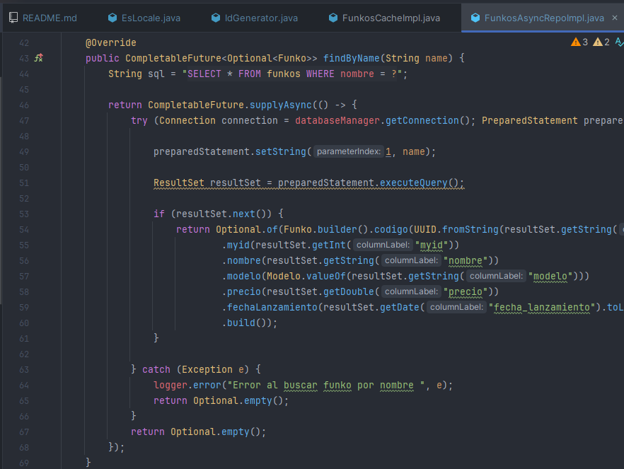
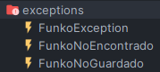

# FUNKOS ASÍNCRONOS
Es una aplicación que permite gestionar datos de funkos almacenados en una base de datos, funciona de manera asíncrona.

## Autores

- Jorge Benavente Liétor
- David Jaraba Pascual

## Requisitos
- Java 17 o superior
- Gradle
- Fichero CSV seperadado por `,` con nombre `funkos.csv` en la carpeta `data` que contenga la información de los pokemons.

## Configuración
Obtiene los datos de conexión de la base datos del fichero **applicaction.properties**  que tiene este formato:

    db.username=sa
    db.password=1234
    db.name=default
    db.loadTables=true
    db.initScript=init.sql
    db.stringDB=jdbc:h2:./funkos_async/db;DB_CLOSE_DELAY=-1;DB_CLOSE_ON_EXIT=FALSE
En el cuál también se puede indicar el fichero SQL que quieres que te cargue para inicializar la base datos.

## Arquitectura seguida en el código
El proyecto esta estructurado en varias clases separadas con tal de definir el funcionamiento distinto de cada una. Por tanto las clases importantes del proyecto son:

La clase [FunkosAsyncRepoImpl](src/main/java/dev/repositories/FunkosAsyncRepoImpl.java) que devuelve CompletableFuture por cada método para poder trabajar de manera asíncrona.

La clase [FunkosServiceImpl](src/main/java/dev/services/FunkosServiceImpl.java) que se encarga usar los métodos de la clase FunkosAsyncRepoImpl y devolver los datos de manera asíncrona.

La clase [FunkosController](src/main/java/dev/controllers/FunkosControllerImpl.java) que se encarga de recibir las peticiones y devolver la respuesta.

La clase [FunkosCache](src/main/java/dev/services/cache/FunkosCacheImpl.java) que se encarga de almacenar los datos en una caché de un determinado tamaño.

La clase [DatabaseManager](src/main/java/dev/services/database/DatabaseManager.java) que se encarga de gestionar la base de datos usando una instancia única y conectándose a la BD 
dependiendo de la configuración del fichero **application.properties**.

**Otras clases:**

El record [Funko](src/main/java/dev/database/models/Funko.java) representa un Funko.

La clase [IdGenerator](src/main/java/dev/services/generator/IdGenerator.java) se encarga de generar un id único para cada Funko y se encuentra protegido ante accesos multihilo.

La clase [FunkosStorageImpl](src/main/java/dev/services/storage/FunkosStorageImpl.java) se encarga de almacenar los datos en un JSON y lee un CSV con datos de funkos.

Las clases que contienen excepciones propias del programa.

